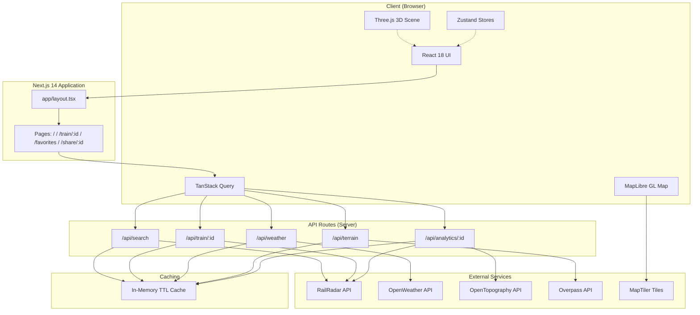

# 🚆 RailGaadi AI

**Real-Time Indian Railway Intelligence Platform**

RailGaadi AI is a modern web application that provides real-time Indian train tracking, live journey visualization, weather intelligence along routes, terrain and elevation analysis, and comprehensive journey analytics. Built with a premium glassmorphism UI and an immersive 3D railway visualization, it transforms raw railway API data into a rich, interactive experience.

     

---

## ✨ Features

| Feature | Description |
|---------|-------------|
| 🔍 **Train Search** | Search Indian trains by number or name from a database of 105+ trains with instant local results |
| 📍 **Live Train Tracking** | Real-time train position on an interactive MapLibre GL map with animated markers and route polylines |
| 🚄 **Journey Dashboard** | Comprehensive journey card showing speed, distance, ETA, progress, and delay status with animated counters |
| 🕐 **Station Timeline** | Scrollable, searchable station-by-station timeline with auto-scroll to current station, delay indicators, and platform info |
| ⏱️ **Auto-Refresh** | Live data polling every 30 seconds via TanStack Query with configurable auto-refresh |
| 🗺️ **Interactive Map** | Full route visualization with station markers, train position popup, zoom controls, and follow-train mode |
| 🌦️ **Weather Intelligence** | Real-time weather data for current, next, and destination stations via OpenWeather API |
| ⛰️ **Terrain & Elevation** | Elevation profile charts, terrain POIs (bridges, tunnels, rivers, mountains) via OpenTopography and Overpass APIs |
| 📊 **Journey Analytics** | Distance covered, highest elevation, delay history, and per-station delay visualization |
| ❤️ **Favorites** | Save and quickly access frequently tracked trains (persisted to localStorage) |
| 🔗 **Share Journeys** | Generate shareable links for any train journey |
| 🌗 **Light / Dark Theme** | Light theme by default with user-toggleable dark mode, persisted across sessions |
| 🎆 **3D Railway Visualization** | Immersive Three.js scene with India outline, 6 major railway routes, animated train nodes, and floating particles |
| 📱 **Responsive Design** | Full mobile support with bottom navigation, mobile journey summary, and adaptive layouts |
| ⚡ **Graceful Fallbacks** | Every API has a fallback — local train database, simulated elevation, default weather — the app works even when external APIs are unavailable |

---


## 🧠 How It Works

```
User searches train number/name
         │
         ▼
┌─────────────────────┐
│   Next.js Frontend   │  React 18 + TanStack Query + Zustand
└────────┬────────────┘
         │
         ▼
┌─────────────────────┐
│    Next.js API Layer │  Server-side API routes (app/api/*)
└────────┬────────────┘
         │
    ┌────┼────┬─────────┬──────────────┐
    ▼    ▼    ▼         ▼              ▼
┌──────┐ ┌────────┐ ┌──────────┐ ┌──────────┐ ┌─────────┐
│Rail  │ │Open    │ │OpenTopo- │ │Overpass  │ │MapTiler │
│Radar │ │Weather │ │graphy    │ │API       │ │(map     │
│API   │ │API     │ │DEM API   │ │(POIs)    │ │tiles)   │
└──┬───┘ └───┬────┘ └────┬─────┘ └────┬─────┘ └────┬────┘
   │         │           │            │             │
   └────┬────┘           └─────┬──────┘             │
        ▼                      ▼                    ▼
   ┌──────────┐          ┌──────────┐         ┌──────────┐
   │ In-Memory │          │ Station  │         │ MapLibre │
   │ TTL Cache │          │ Timeline │         │ GL Map   │
   └──────────┘          └──────────┘         └──────────┘
```

**Data flow:**
1. User searches → `/api/search` queries RailRadar API (falls back to local 105-train database)
2. Train selected → `/api/train/:id` fetches live position, route, and station data from RailRadar
3. Map renders → Route polyline and train marker displayed via MapLibre GL with MapTiler tiles
4. Weather loads → `/api/weather` fetches conditions for current, next, and destination stations
5. Analytics load → `/api/analytics/:id` combines RailRadar journey data with OpenTopography elevation data
6. Terrain loads → `/api/terrain` fetches POIs along the route via Overpass API
7. All data cached in-memory with TTL (30s for live data, 15min for weather, 24h for terrain)

---

## 🏗️ Architecture



---

## 🛠️ Tech Stack

| Category | Technology | Version | Purpose |
|----------|-----------|---------|---------|
| **Framework** | Next.js | 14.2 | App Router, SSR, API routes |
| **UI Library** | React | 18.3 | Component rendering |
| **Language** | TypeScript | 5.5 | Type safety |
| **Styling** | Tailwind CSS | 3.4 | Utility-first CSS |
| **Maps** | MapLibre GL | 4.5 | Interactive map rendering |
| **3D** | Three.js | 0.185 | 3D railway visualization |
| **3D Framework** | React Three Fiber | 8.17 | React renderer for Three.js |
| **3D Utilities** | @react-three/drei | 9.114 | R3F helpers and components |
| **State (Client)** | Zustand | 4.5 | Search, journey, favorites stores |
| **Data Fetching** | TanStack Query | 5.x | Server state, caching, polling |
| **Animation** | Framer Motion | 11.x | UI transitions and animations |
| **Animation** | GSAP | 3.15 | High-performance animations |
| **Icons** | Lucide React | 0.417 | Icon library |
| **Geo Utilities** | Turf.js | 7.x | Geospatial calculations |
| **UI Utilities** | clsx + tailwind-merge | — | Conditional class merging |
| **UI Primitives** | class-variance-authority | 0.7 | Component variant styling |

---

## 📁 Project Structure

```text
railgaadi-ai/
├── app/
│   ├── api/
│   │   ├── analytics/[id]/route.ts   # Journey analytics + elevation
│   │   ├── search/route.ts           # Train search (RailRadar + local DB)
│   │   ├── terrain/route.ts          # Terrain POIs (Overpass API)
│   │   ├── train/[id]/route.ts       # Live journey data (RailRadar)
│   │   └── weather/route.ts          # Weather data (OpenWeather)
│   ├── favorites/page.tsx            # Saved trains page
│   ├── share/[id]/page.tsx           # Public shared journey page
│   ├── train/[id]/page.tsx           # Live train tracking dashboard
│   ├── layout.tsx                    # Root layout (providers, fonts, metadata)
│   ├── page.tsx                      # Landing page with search + 3D hero
│   ├── error.tsx                     # Global error boundary
│   └── not-found.tsx                 # 404 page
├── components/
│   ├── 3d/
│   │   └── IndiaRailwayNetwork.tsx   # Three.js 3D India railway map
│   ├── journey/
│   │   ├── DelayBadge.tsx            # Delay status badge
│   │   ├── ETAChip.tsx               # ETA display chip
│   │   ├── JourneyCard.tsx           # Main journey status card
│   │   ├── ProgressRing.tsx          # SVG circular progress
│   │   └── Timeline.tsx              # Station-by-station timeline
│   ├── landing/
│   │   ├── CTASection.tsx            # Call-to-action banner
│   │   ├── FeaturesSection.tsx       # Feature cards grid
│   │   ├── Footer.tsx                # Site footer
│   │   ├── HeroSection.tsx           # Hero with 3D background
│   │   └── IntelligenceSection.tsx   # AI features showcase
│   ├── layout/
│   │   ├── BottomNav.tsx             # Mobile bottom navigation
│   │   ├── MobileJourneySummary.tsx  # Compact mobile overview
│   │   └── Navbar.tsx                # Top navigation bar
│   ├── search/
│   │   ├── SearchBar.tsx             # Reusable search input
│   │   └── SearchResults.tsx         # Search results list
│   └── ui/
│       ├── AnimatedCounter.tsx       # Animated number counter
│       ├── EmptyState.tsx            # Empty state placeholder
│       ├── ErrorCard.tsx             # Error display with retry
│       ├── GlassCard.tsx             # Glassmorphism card
│       ├── Skeleton.tsx              # Loading skeleton
│       └── StatusBadge.tsx           # Train status badge
├── config/
│   └── env.ts                        # Centralized environment config
├── features/
│   ├── analytics/
│   │   ├── AnalyticsDashboard.tsx    # Journey analytics panel
│   │   └── ElevationProfile.tsx      # SVG elevation chart
│   ├── favorites/
│   │   └── FavoriteButton.tsx        # Heart toggle button
│   ├── maps/
│   │   └── MapView.tsx               # MapLibre GL live map
│   ├── terrain/
│   │   ├── TerrainCard.tsx           # Terrain feature card
│   │   └── TerrainPanel.tsx          # Terrain POI panel
│   └── weather/
│       ├── WeatherCard.tsx           # Individual weather card
│       └── WeatherPanel.tsx          # Weather intelligence panel
├── hooks/
│   ├── useLiveJourney.ts             # TanStack Query hook for live data
│   └── useTrainSearch.ts             # Local train search hook
├── lib/
│   ├── cache.ts                      # In-memory TTL cache
│   ├── india/
│   │   └── routes.ts                 # Railway routes + India outline
│   ├── openweather.ts                # OpenWeather API client
│   ├── opentopography.ts             # OpenTopography DEM client
│   ├── overpass.ts                   # Overpass API client
│   ├── railradar.ts                  # RailRadar API client
│   └── trains-db.ts                  # Static train database (105+ trains)
├── providers/
│   ├── query-provider.tsx            # TanStack Query provider
│   └── theme-provider.tsx            # Light/dark theme provider
├── store/
│   ├── favorites.ts                  # Favorites (persisted)
│   ├── journey.ts                    # Active train state
│   └── search.ts                     # Recent searches (persisted)
├── styles/
│   └── globals.css                   # Tailwind + theme tokens + glassmorphism
├── types/
│   ├── api.ts                        # API response types
│   └── train.ts                      # Train, Station, Journey types
├── utils/
│   ├── cn.ts                         # clsx + tailwind-merge
│   └── format.ts                     # Formatting utilities
├── .env                              # Environment variables
├── .gitignore
├── next.config.mjs
├── package.json
├── tailwind.config.ts
└── tsconfig.json
```

---

## 🔌 API / Integrations

| Service | Purpose | API Route | Caching |
|---------|---------|-----------|---------|
| [RailRadar](https://railradar.in) | Real-time train data, live tracking, route geometry | `/api/search`, `/api/train/:id`, `/api/analytics/:id`, `/api/terrain` | 30s – 600s |
| [OpenWeather](https://openweathermap.org/api) | Weather conditions along the route | `/api/weather` | 15 min |
| [OpenTopography](https://opentopography.org/) | Digital elevation model (DEM) for terrain profiles | `/api/analytics/:id` | 5 min |
| [Overpass API](https://overpass-api.de/) | Terrain POIs — bridges, tunnels, rivers, mountains | `/api/terrain` | 24 hours |
| [MapTiler](https://www.maptiler.com/) | Map tile provider for MapLibre GL | Client-side only | N/A |

> **Fallback Strategy:** Every API route includes graceful fallbacks. If RailRadar is unreachable, the app falls back to a local static database of 105+ trains. If OpenTopography fails, a simulated elevation curve is generated. If Overpass fails, synthetic terrain POIs are returned.

---

## 🔐 Environment Variables

Create a `.env` file in the project root:

```env
# RailRadar — Real-time Indian railway data
RAILRADAR_API_KEY=your_railradar_api_key

# MapTiler — Map tiles (client-exposed via NEXT_PUBLIC_)
NEXT_PUBLIC_MAPTILER_API_KEY=your_maptiler_api_key

# OpenWeather — Weather data along routes
OPENWEATHER_API_KEY=your_openweather_api_key

# OpenTopography — Elevation/DEM data
OPENTOPOGRAPHY_API_KEY=your_opentopography_api_key

# Upstash Redis — Distributed caching (optional)
UPSTASH_REDIS_REST_URL=your_upstash_redis_url
UPSTASH_REDIS_REST_TOKEN=your_upstash_redis_token
```

| Variable | Scope | Used For |
|----------|-------|----------|
| `RAILRADAR_API_KEY` | Server | Train search and live tracking API |
| `NEXT_PUBLIC_MAPTILER_API_KEY` | Client + Server | Map tile rendering (exposed to browser) |
| `OPENWEATHER_API_KEY` | Server | Weather data for stations |
| `OPENTOPOGRAPHY_API_KEY` | Server | Elevation/digital elevation model data |
| `UPSTASH_REDIS_REST_URL` | Server | Distributed cache endpoint |
| `UPSTASH_REDIS_REST_TOKEN` | Server | Distributed cache authentication |

> ⚠️ **Never commit your `.env` file or expose private API credentials.** The `NEXT_PUBLIC_` prefix exposes the key to the browser — only use it for keys that are safe for client-side use.

---

## 🚀 Getting Started

### Prerequisites

- **Node.js** 18+ (recommended: 20 LTS)
- **npm** 9+ (or yarn/pnpm)
- API keys for RailRadar, MapTiler, and OpenWeather (see [Environment Variables](#-environment-variables))

### 1. Clone the repository

```bash
git clone <YOUR_GITHUB_REPOSITORY_URL>
cd RailGaadi-main
```

### 2. Install dependencies

```bash
npm install
```

### 3. Configure environment variables

Create a `.env` file in the project root and add your API keys:

```bash
# Copy the structure from the Environment Variables section above
# and fill in your actual API keys
```

### 4. Start the development server

```bash
npm run dev
```

Open [http://localhost:3000](http://localhost:3000) in your browser.

### 5. Production build

```bash
npm run build
npm start
```

---

## 🎯 Usage

1. **Search** — Enter a train number or name on the landing page (e.g., `12951` for Rajdhani Express)
2. **Select** — Click a train from the search results to open the live tracking dashboard
3. **Track** — View the train's real-time position on the interactive map with live route visualization
4. **Monitor** — Check speed, distance covered, ETA, and journey progress in the dashboard card
5. **Explore Stations** — Scroll through the station timeline to see arrival times, delays, and platform info
6. **Weather** — Switch to the Weather tab to see conditions at the current, next, and destination stations
7. **Terrain** — Switch to the Terrain & Analytics tab for elevation profiles and terrain features along the route
8. **Save** — Click the heart icon to save a train to your favorites for quick access later
9. **Share** — Click the Share button to generate a link to the live journey that others can view
10. **Theme** — Toggle between light and dark mode using the Sun/Moon icon in the navbar

---

## 🗺️ Live Tracking

The live tracking dashboard provides real-time journey intelligence:

| Data Point | Source | Refresh Rate |
|-----------|--------|-------------|
| Train GPS position | RailRadar API | 30 seconds |
| Current speed (km/h) | RailRadar API | 30 seconds |
| Current station | RailRadar API | 30 seconds |
| ETA at next station | RailRadar API | 30 seconds |
| Journey completion % | RailRadar API | 30 seconds |
| Delay (minutes) | RailRadar API | 30 seconds |
| Route geometry | RailRadar API | On load |
| Station arrival/departure | RailRadar API | On load |

**Map features:**
- Animated train marker with speed and status popup
- Station markers with hover popups showing name, code, and platform
- Route polyline with glow effect
- Follow-train mode (auto-centers on train position)
- Zoom to fit entire route

---

## 🌦️ Weather & Terrain

**Weather Intelligence:**
- Real-time weather conditions (temperature, humidity, wind, rain probability) for up to 3 key stations
- Condition icons and formatted descriptions
- Data sourced from OpenWeather API with 15-minute cache

**Terrain Analysis:**
- Elevation profile rendered as an SVG area chart showing terrain height along the route
- Highest elevation point highlighted
- Terrain POIs (Points of Interest) including bridges, tunnels, rivers, mountains, and tourist spots
- Sourced from OpenTopography (DEM data) and Overpass API (POI data)

---

## 🌗 Theme System

| Behavior | Detail |
|----------|--------|
| **Default theme** | Light |
| **Toggle** | Sun/Moon icon in the navbar |
| **Persistence** | Saved to `localStorage` (`railgaadi-theme`) |
| **System preference** | Ignored — user selection is always respected |
| **Map adaptation** | Map style switches between light and dark MapTiler/CARTO tiles |
| **3D adaptation** | Three.js scene adjusts lighting, colors, and particle opacity |
| **Transition** | Smooth 250ms crossfade between themes |
| **FOUC prevention** | Inline `<script>` in `<head>` applies the saved theme before first paint |

---

## 📱 Responsive Design

| Breakpoint | Layout |
|-----------|--------|
| **Desktop (lg+)** | Two-column dashboard grid: left (map/weather/analytics) + right (sticky station timeline) |
| **Tablet (md)** | Single column with tabbed content, journey card visible |
| **Mobile (sm)** | Stacked layout, bottom navigation bar, compact journey summary, scrollable timeline with max-height |

- Mobile bottom navigation with Home, Search, and Favorites tabs
- Touch-friendly station timeline with internal scrolling
- Responsive map sizing
- Hamburger menu for additional navigation on mobile

---

## ⚡ Performance

| Optimization | Implementation |
|-------------|---------------|
| **Data caching** | In-memory TTL cache on all API routes (30s for live data, up to 24h for terrain) |
| **Query caching** | TanStack Query with 25s stale time, 30s polling interval |
| **Lazy loading** | MapLibre GL map loaded via `next/dynamic` with `ssr: false` |
| **Code splitting** | Automatic via Next.js App Router (each page is a separate chunk) |
| **Static pages** | Landing page, favorites, and not-found pages are statically generated |
| **Optimized 3D** | `InstancedMesh` for particles, `useFrame` for animation, auto-rotate with bounded polar angle |
| **FOUC prevention** | Inline theme script avoids flash of unstyled content |
| **Graceful degradation** | Every external API has a fallback — the app never shows a broken state |
| **Reduced motion** | All animations respect `prefers-reduced-motion: reduce` |

---

## 🧪 Verification

```bash
# Type checking and linting
npm run build

# Expected output:
# ✓ Compiled successfully
# ✓ Linting and checking validity of types
# ✓ Generating static pages
# BUILD SUCCESS — 0 errors
```

> The production build has been verified passing with 0 errors. The application is tested across the landing page, train tracking dashboard, favorites, and shared journey pages.

---

## 🚢 Deployment

RailGaadi AI is a standard Next.js application and can be deployed to any platform that supports Node.js:

**Recommended: [Vercel](https://vercel.com)**

1. Push the repository to GitHub
2. Import the project on Vercel
3. Configure environment variables in the Vercel dashboard
4. Deploy

```bash
# Or deploy via Vercel CLI
npx vercel
```

> **Important:** Ensure all environment variables (`RAILRADAR_API_KEY`, `NEXT_PUBLIC_MAPTILER_API_KEY`, `OPENWEATHER_API_KEY`, `OPENTOPOGRAPHY_API_KEY`) are configured in your deployment platform's environment settings.

---

## 🔒 Security

- All server-side API keys (`RAILRADAR_API_KEY`, `OPENWEATHER_API_KEY`, `OPENTOPOGRAPHY_API_KEY`, `UPSTASH_REDIS_REST_TOKEN`) are accessed only through server-side API routes and are **never exposed to the client**
- `NEXT_PUBLIC_MAPTILER_API_KEY` is the only client-exposed key and should be safe for public use
- The `.env` file is listed in `.gitignore` — never commit environment files
- Redis credentials must remain private and server-side only
- API routes include rate limiting via in-memory caching to reduce external API calls

---

## 🛣️ Roadmap

> The following features are planned or under consideration for future development:

| Feature | Status |
|---------|--------|
| Delay prediction using ML models | Planned |
| Advanced route optimization analytics | Planned |
| Push notifications for train status changes | Planned |
| Multi-language support (Hindi, Tamil, etc.) | Planned |
| Offline mode with service worker | Planned |
| Detailed Indian railway network map | Planned |
| Historical journey data and trends | Planned |
| User accounts and journey history | Planned |

---

## 🤝 Contributing

1. **Fork** the repository
2. **Create** a feature branch (`git checkout -b feature/amazing-feature`)
3. **Commit** your changes (`git commit -m 'Add amazing feature'`)
4. **Push** to the branch (`git push origin feature/amazing-feature`)
5. **Open** a Pull Request

Please ensure:
- `npm run build` passes with 0 errors
- No new environment variables are exposed to the client without `NEXT_PUBLIC_` prefix
- Components follow the existing theme-aware patterns (no hardcoded `text-white` / `text-black`)

---

## 📄 License

License has not been specified yet.

---

## 👨‍💻 Author

Developed by the RailGaadi AI team.

---

> Built with ❤️ for Indian Railways.
